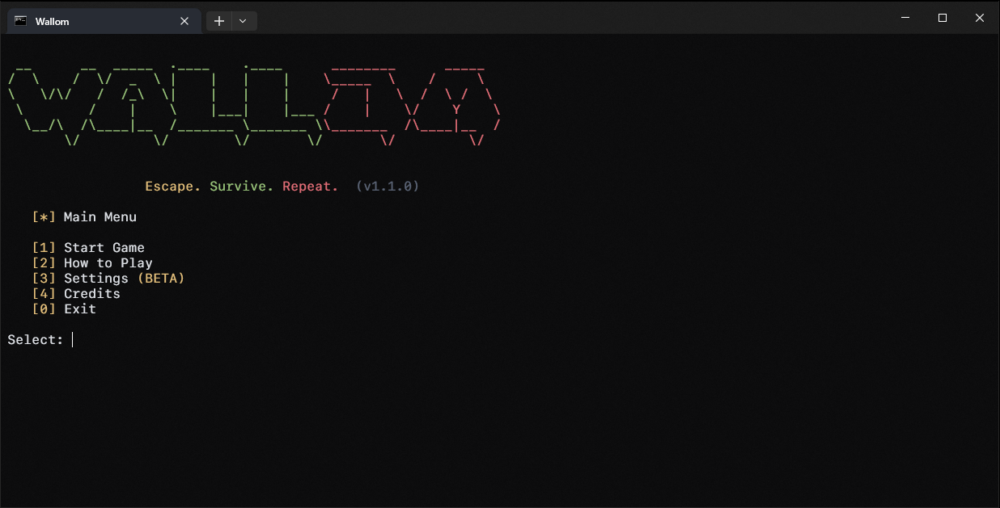
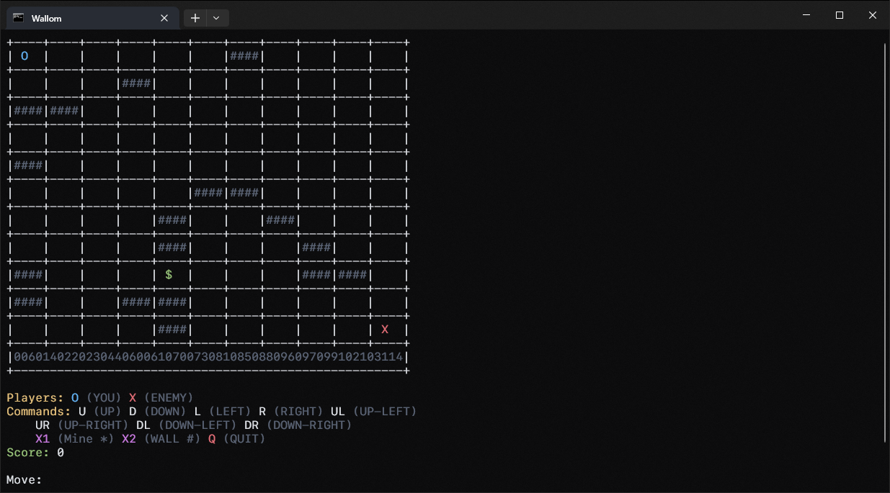

# 🎮 Wallom


> A **terminal-based grid survival game** built entirely in PowerShell.

Escape. Survive. Repeat.

---

## 🧠 Overview

**Wallom** is a lightweight, terminal-based strategy game where you control a player in a grid world filled with:
- AI-driven enemy
- mines and traps
- walls
- collectibles
- persistent game state (JSON save system)

The game is built as a **modular PowerShell engine**, simulating a mini game framework inside the terminal.

---

## 📸 Screenshots

### 🎮 Main Menu


### 🧱 Gameplay Grid


---

## 🚀 Features

- 🧠 AI-based enemy movement system
- 💣 Mine system (X1) with radius damage
- 🧱 Wall bombs (X2) that become permanent obstacles
- ⭐ Collectible points system ($)
- 💾 Persistent save system using JSON
- 🎨 ANSI color-based terminal UI
- 🗺 Procedural map generation
- 🎮 Modular engine architecture

---

## 🎮 Controls

| Key | Action |
|-----|--------|
| U | Move Up |
| D | Move Down |
| L | Move Left |
| R | Move Right |
| UL / UR / DL / DR | Diagonal Movement |
| X1 | Place Mine |
| X2 | Place Wall Bomb |
| Q | Quit Game |

---

## 🧩 Game Rules

- Collect **$** to increase score
- Enemy dies if it steps on a mine
- Max **5 active mines**
- Mines expire after **5 turns**
- Walls block movement
- Objective: Eliminate enemy

---

## 📦 Project Structure

```

Wallom/
│
├── Wallom.bat
│
└── bin/
├── engine.ps1
├── grid.ps1
├── enemy.ps1
├── bomb.ps1
├── db.ps1
├── colors.ps1
├── splash.ps1
├── ui_logo.ps1
├── ui_help.ps1
└── ui_credits.ps1

````

---

## ⚙️ How to Run

### Windows
```bash
Wallom.bat
````

---

## 💾 Save System

Wallom uses a lightweight JSON-based persistence system:

* Each session has a unique `gameId`
* Stores:

  * player position
  * enemy position
  * score
  * walls
  * bombs
  * collectibles

> Save file: `database.json`

---

## 🛠 Tech Stack

* PowerShell (core engine)
* Batch script launcher
* ANSI terminal UI
* JSON-based persistence

---

## 📜 License

This project is licensed under the MIT License.

👉 See full license here:
[LICENSE](./LICENSE)

---

## 🤝 Contributing

Contributions are welcome!

Please read the contribution guidelines before submitting PRs:

👉 [CONTRIBUTING.md](./CONTRIBUTING.md)

---

## 👨‍💻 Author

**Kishan Pujari**
📧 [kishanpujari.dev@gmail.com](mailto:kishanpujari.dev@gmail.com)

---

## ⭐ Future Plans

* 🔊 Sound effects (terminal beeps)
* 🧠 smarter AI (A* pathfinding)
* 🎮 level system
* 🗺 bigger maps with scrolling
* 🎨 theme system (dark/light modes)

---

## 🚀 Inspiration

Built as a fun experiment to push **PowerShell beyond scripting into game engine territory**.

> “Small tools. Big imagination.”